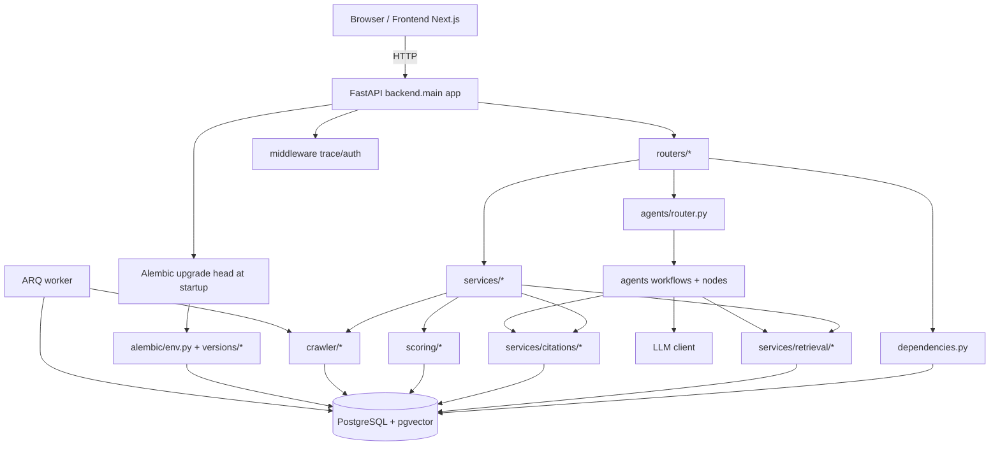
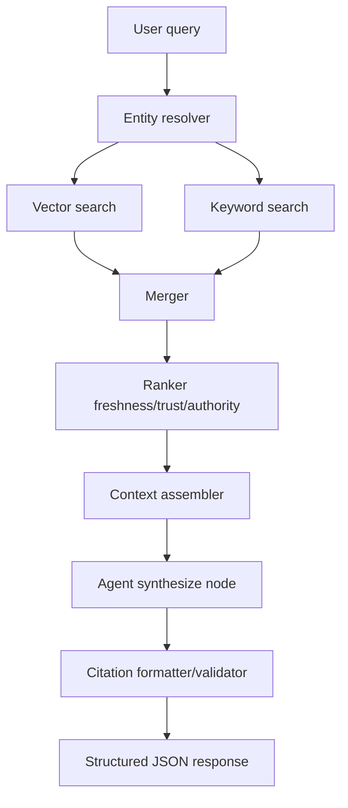

# CRMind Application Graph Tree

This document provides a fast-traversal map of the codebase: structure, runtime flows, and debugging entry points.

## 1) Repository Tree (Navigation-First)

```text
Search Gateway/
├── backend/
│   ├── main.py                        # FastAPI app, lifespan, startup migrations
│   ├── config.py                      # env + settings
│   ├── database.py                    # asyncpg pool
│   ├── dependencies.py                # DI wiring
│   ├── worker.py                      # ARQ worker entrypoint
│   ├── middleware/
│   │   ├── auth.py                    # JWT auth middleware/deps
│   │   └── trace.py                   # trace_id context + request tracing
│   ├── routers/
│   │   ├── auth.py                    # signup/login/me/password/api-key
│   │   ├── search.py                  # retrieval/search API
│   │   ├── enrich.py                  # enrichment API
│   │   ├── entities.py                # entity endpoints
│   │   ├── accounts.py                # account brief endpoints
│   │   ├── contacts.py                # contacts endpoints
│   │   ├── signals.py                 # signal endpoints
│   │   ├── crawl.py                   # crawl queue endpoints
│   │   ├── agents.py                  # agent run + stream endpoints
│   │   ├── health.py                  # liveness/readiness
│   │   └── user.py                    # user profile/account endpoints
│   ├── agents/
│   │   ├── router.py                  # workflow registry + dispatch
│   │   ├── state.py                   # typed state
│   │   ├── llm_client.py              # LLM client + retry/breaker
│   │   ├── graph_runtime.py           # graph execution runtime helpers
│   │   ├── lead_finder.py             # lead finder workflow
│   │   ├── account_brief.py           # account brief workflow
│   │   ├── crm_enrichment.py          # enrichment workflow
│   │   ├── research.py                # research workflow
│   │   ├── ops_debug.py               # ops/debug workflow
│   │   └── nodes/                     # node-level graph steps
│   ├── services/
│   │   ├── entity_resolver.py         # canonical entity matching
│   │   ├── embedding_service.py       # embeddings provider wrapper
│   │   ├── query_cache.py             # query cache
│   │   ├── fact_resolver.py           # fact conflict resolution
│   │   ├── signal_extractor.py        # signal extraction
│   │   ├── user_service.py            # user CRUD/auth support
│   │   ├── retrieval/                 # vector/keyword/merge/rank/context
│   │   └── citations/                 # citation assembly/validation
│   ├── crawler/
│   │   ├── fetcher.py                 # page fetch
│   │   ├── extractor.py               # clean text extraction
│   │   ├── robots.py                  # robots policy checks
│   │   ├── rate_limiter.py            # per-domain throttling
│   │   ├── chunker.py                 # content chunking
│   │   ├── store.py                   # dedup + chunk persistence
│   │   └── queue_worker.py            # crawl queue processing
│   ├── scoring/
│   │   ├── freshness.py               # freshness score
│   │   ├── trust.py                   # trust score
│   │   ├── authority.py               # source authority score
│   │   ├── signals.py                 # signal confidence score
│   │   └── batch_refresh.py           # score recompute jobs
│   ├── models/
│   │   ├── requests.py                # pydantic request schemas
│   │   └── responses.py               # response contracts
│   └── utils/
│       ├── retry.py                   # tenacity wrappers
│       ├── circuit_breaker.py         # breaker primitives
│       ├── sanitize.py                # prompt/input sanitization
│       ├── exceptions.py              # domain exceptions
│       └── etag.py                    # ETag helpers
├── alembic/
│   ├── env.py                         # migration runtime config
│   └── versions/
│       ├── 001_initial_schema_placeholder.py
│       ├── 002_add_embed_model_id.py
│       ├── 003_add_trace_id_agent_runs.py
│       ├── 006_add_hnsw_index.py
│       ├── 007_enable_rls.py
│       ├── 008_user_auth_storage.py
│       ├── 009_user_rls_policies.py
│       ├── 010_local_auth_postgres.py
│       └── 011_remove_supabase_legacy_auth.py
├── frontend/
│   ├── app/                           # Next.js app router pages
│   ├── components/                    # UI components
│   ├── context/                       # auth + app context
│   ├── lib/                           # API clients/helpers
│   ├── types/                         # TS interfaces
│   └── middleware.ts                  # Next middleware
├── scripts/                           # init/seed/batch/rembed/cleanup
├── tests/                             # unit/integration/contract/e2e/load
├── supabase/migrations/001_initial.sql # canonical base schema bootstrap SQL
├── Dockerfile
├── docker-compose.yml
├── render.yaml
└── README.md
```

## 2) Runtime Graph (High-Level)



## 3) Startup / Migration Graph

```mermaid
flowchart TD
  A[Process starts: uvicorn backend.main:app] --> B[lifespan enters]
  B --> C[run_migrations()]
  C --> D[alembic upgrade head]
  D --> E[001 bootstrap schema from supabase SQL if needed]
  E --> F[002,003,... sequential revisions]
  F --> G[DB ready]
  G --> H[FastAPI serves requests]

  D -->|failure| X[RuntimeError: Startup migrations failed]
```

## 4) Auth Flow Graph

```mermaid
flowchart LR
  UI[login/signup forms] --> API[/api/v1/auth/*]
  API --> SRV[user_service + auth router logic]
  SRV --> DB[(users table)]
  API --> JWT[JWT issue/verify]
  JWT --> MW[middleware/auth.py]
  MW --> PROT[protected routes]
```

## 5) Retrieval + Agent Flow Graph



## 6) Debugging Index (Where to Start)

- Startup migration failures: backend/main.py, alembic/env.py, alembic/versions/*
- Auth/signup/login issues: backend/routers/auth.py, backend/middleware/auth.py, frontend/context/*
- CORS and trace visibility: backend/main.py, backend/middleware/trace.py
- Retrieval quality: backend/services/retrieval/*, backend/scoring/*
- Citation gaps: backend/services/citations/*
- Crawl ingestion failures: backend/crawler/*, backend/worker.py, backend/routers/crawl.py
- Agent runtime issues: backend/agents/router.py, backend/agents/nodes/*, backend/agents/llm_client.py

## 7) Current Critical Migration Note

The HNSW index migration must only run when `chunks.embedding` is fixed-dimension `vector(n)`.
If the column is unbounded `VECTOR`, index creation is skipped to keep deploy/startup healthy.
